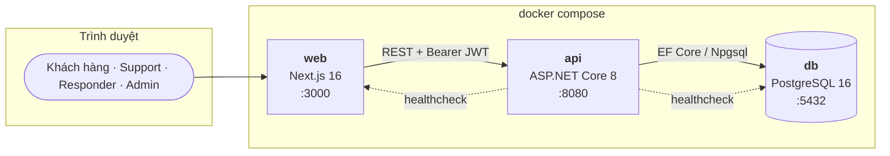
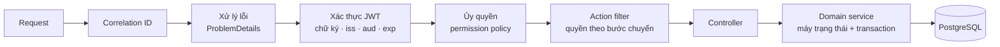

<div align="center">

<!--
Sau khi đẩy lên GitHub, dán badge CI vào hàng badge ở trên:
[](https://github.com/<OWNER>/<REPO>/actions/workflows/ci.yml)
-->

---

## Vấn đề

Sự cố hệ thống và phàn nàn của khách hàng thường được ghi nhận rời rạc qua chat, email và bảng
tính. Hậu quả là không ai biết sự cố nào đang được xử lý, không truy vết được thời điểm chuyển
trạng thái, và quyền thao tác bị gán tùy tiện ngay trong mã nguồn.

**Incident & Feedback Tracker** thay thế cách làm đó bằng một luồng xử lý duy nhất, có ràng buộc
chặt và có bằng chứng:

- **Vòng đời một chiều.** Sự cố chỉ đi tiến một bước: `Investigating → Mitigating → Resolved`.
  Nhảy bậc, lùi trạng thái hay chuyển trùng đều bị từ chối bằng `409`, nên số liệu đo thời gian
  khắc phục không thể bị thao túng.
- **Truy vết không thể mất.** Mỗi lần chuyển trạng thái thành công sinh **đúng một** dòng lịch
  sử, ghi trong cùng transaction với việc đổi trạng thái. Bản ghi lịch sử chỉ ghi thêm, không có
  endpoint nào sửa hay xóa được.
- **Sửa được, nhưng không sửa lén.** Nội dung sự cố, bình luận và phản hồi khách hàng đều sửa được
  — và mỗi trường đổi giá trị để lại một dòng lịch sử ghi nguyên văn cũ kèm tên người bấm nút, kể cả
  khi chính tác giả sửa bài mình. Sửa bài người khác thì dòng đó mang thêm dấu "sửa hộ".
- **Hai người cùng sửa thì không ai mất chữ.** Mở form sửa là giữ một chỗ; chừng nào còn người khác
  đang giữ chỗ, lần ghi kế tiếp buộc phải kèm `If-Match` đúng phiên bản — ghi đè lặng lẽ không còn
  là một đường đi được. Ngoài lúc tranh chấp, mọi thứ vẫn nhẹ như cũ.
- **Phân quyền là dữ liệu, không phải mã.** Quản trị viên thêm quyền, tạo vai trò và gán quyền
  hoàn toàn qua giao diện — không sửa mã, không migration, không triển khai lại.

---

## Bắt đầu nhanh

**Yêu cầu:** Docker và Docker Compose. Không cần cài .NET SDK hay Node.js.

```bash
git clone <repo-url> && cd WEB--Web-Advantage
cp .env.example .env
```

Mở `.env` và đổi ba giá trị bí mật — `POSTGRES_PASSWORD`, `JWT_SIGNING_KEY` (tối thiểu 32 ký tự,
sinh bằng `openssl rand -base64 48`) và `SEED_ADMIN_PASSWORD`.

```bash
docker compose down -v && docker compose up --build -d --wait
```

Khoảng một phút sau, cả ba service sẽ ở trạng thái healthy:

```bash
curl -s http://localhost:8080/api/health/system
# {"status":"Healthy","checks":[{"name":"api",...},{"name":"db",...},{"name":"web",...}]}
```

| Địa chỉ                                                                        | Nội dung                 |
| :-------------------------------------------------------------------------------- | :------------------------ |
| [http://localhost:3000](http://localhost:3000)                                     | Giao diện web            |
| [http://localhost:8080/swagger](http://localhost:8080/swagger)                     | Swagger UI                |
| [http://localhost:8080/api/health/system](http://localhost:8080/api/health/system) | Sức khỏe cả ba service |
| [http://localhost:8080/metrics](http://localhost:8080/metrics)                     | Prometheus scrape         |

Đăng nhập bằng `SEED_ADMIN_EMAIL` / `SEED_ADMIN_PASSWORD`, rồi vào **Quản trị** để tạo tài khoản
Support và Responder.

> `SEED_ADMIN_PASSWORD` để trống thì hệ thống **không tạo admin nào cả** — đây là chủ ý, để
> không tồn tại mật khẩu mặc định đoán được.

### Dữ liệu trình diễn

Muốn có sẵn người dùng, project, ticket, sự cố và phản hồi để xem ngay thì đặt thêm dòng sau
trong `.env` **trước lần chạy đầu**:

```bash
SEED_DEMO_DATA=true
```

Bước seed chạy một lần lúc khởi động, sau khi migration đã áp. Quy mô cố định:

| | |
| :-- | :-- |
| Project trình diễn | `demo-alpha` (Demo Alpha), `demo-beta` (Demo Beta) |
| Mỗi project | 9 issue (5 mở, 4 đóng), 25 sự cố, 25 phản hồi, 18 label, 18 milestone |
| Ngoài project | 3 sự cố và 3 phản hồi chưa phân loại, cho mục `uncategorized` |
| Tài khoản | 3 manager, 5 support, 5 responder, 30 khách hàng — mật khẩu chung `Demo#12345` |

Mỗi project có **2 manager, 4 support, 4 responder**, và phần giao là chủ ý: 1 manager, 3 support,
3 responder phụ trách cả hai project, số còn lại chỉ thuộc một project. Có người ngoài project thì
việc cách ly theo project mới có gì để chứng minh.

Seeder cũng cấp **quyền project** cho cả dàn tài khoản đó — không cấp thì mọi tài khoản trừ admin
đều không vào được project nào.

| Vai trò  | Ví dụ tài khoản     | Phạm vi |
| :-------- | :---------------------- | :-- |
| manager   | `bao.long@demo.local` | cả hai project |
| manager   | `minh.anh@demo.local` | chỉ Demo Alpha |
| responder | `thu.ha@demo.local`   | cả hai project |
| support   | `gia.bao@demo.local`  | cả hai project |
| customer  | `anh.tu@demo.local`   | cả hai project |

Tài khoản `admin` và `system` **không** nằm trong dữ liệu trình diễn: admin đến từ
`SEED_ADMIN_EMAIL` / `SEED_ADMIN_PASSWORD`, còn system chỉ tồn tại trong cấu hình triển khai
(`SEED_SYSTEM_EMAIL` / `SEED_SYSTEM_PASSWORD`) và không xuất hiện ở bất kỳ đâu trong mã nguồn.

Đừng bật cờ này ở nơi có dữ liệu thật — dữ liệu giả không có chỗ trong database thật.

Chạy lại `docker compose up -d` không seed lại: bước seed nhận ra dữ liệu đã có và bỏ qua. Muốn
dựng lại từ đầu thì xoá luôn volume:

```bash
docker compose down -v && docker compose up --build -d --wait
```

<details>
<summary><b>Chạy không qua Docker Compose</b></summary>

```bash
# 1. Chỉ dựng database
docker compose -f backend/docker-compose.yml up -d

# 2. API — cần .NET SDK 8
cd backend && cp .env.example .env && set -a && source .env && set +a
dotnet run --project src/IncidentTracker.Api

# 3. Web — cần Node.js 22+
cd frontend && cp .env.example .env.local && npm install && npm run dev
```

</details>

---

## Tính năng

|                                             | Mô tả                                                                                                                                                                                                                                                                                                                     |
| :------------------------------------------ | :-------------------------------------------------------------------------------------------------------------------------------------------------------------------------------------------------------------------------------------------------------------------------------------------------------------------------- |
| **Vòng đời sự cố**               | Ba trạng thái bắt buộc, chỉ tiến một bước. Máy trạng thái nằm ở đúng một chỗ trong mã nguồn; lỗi`409` luôn kèm `allowedNextStatus` để người dùng biết bước hợp lệ tiếp theo                                                                                                           |
| **Lịch sử bất biến**              | Mỗi lần chuyển sinh đúng một dòng, ghi cùng transaction. Sự cố đã xóa mềm vẫn tra cứu được lịch sử để giữ bằng chứng đo SLA                                                                                                                                                                      |
| **RBAC cấu hình được**           | 24 permission dạng`resource.action`, 5 vai trò mặc định. Thêm quyền mới không đổi schema, không migration                                                                                                                                                                                                     |
| **Khách hàng tự phục vụ**        | Khách hàng tự tạo tài khoản, gửi sự cố và phản hồi, theo dõi tiến độ xử lý — không cần Support nhập hộ. Giới hạn được bằng tên miền email hoặc bật chế độ chờ duyệt                                                                                                                   |
| **Phân quyền theo bản ghi**        | Có đúng vai trò vẫn chưa đủ: người dùng chỉ đụng được vào dữ liệu của mình. Danh sách lọc ngay trong SQL nên`totalCount` cũng không rò rỉ. Đây là hàng rào chống BOLA — lỗ hổng số một của OWASP API Top 10                                                                      |
| **Chống tranh chấp**                | `SELECT … FOR UPDATE` trong transaction. 50 người bấm chuyển trạng thái cùng lúc trên một sự cố: đúng một người thành công                                                                                                                                                                            |
| **Cảnh báo SLA**                    | Job nền cảnh báo sự cố ở`Investigating` quá 24 giờ; đồng hồ tính từ mốc bước vào trạng thái hiện tại nên đo tách bạch được từng bước                                                                                                                                                       |
| **Hàng đợi phản hồi**            | Khách hàng gửi phản hồi, Support gắn vào sự cố đang mở để tránh xử lý trùng lặp. Sự cố đã đóng không nhận thêm phản hồi                                                                                                                                                                        |
| **Vòng hội thoại khép kín**      | Khách hàng và đội xử lý trao đổi ngay trên sự cố; doanh nghiệp trả lời phản hồi và khách hàng đọc câu trả lời trên chính phản hồi của mình, kèm trạng thái tiếp nhận`Mới → Đã tiếp nhận → Đã trả lời`                                                                      |
| **Phản hồi tự động**             | Ghi nhận phản hồi xong, hệ thống chèn ngay lời xác nhận tiếp nhận vào luồng trả lời — bật/tắt và đổi nội dung qua`FEEDBACK__AUTOACK*`, không cần hạ tầng email                                                                                                                                  |
| **Ba trạng thái trên UI**          | Mọi thao tác hiển thị đủ`processing` · `success` · `failed`, đi qua một hook duy nhất nên không màn hình nào thiếu sót                                                                                                                                                                              |
| **Giao diện sáng / tối**           | Ba trạng thái: sáng, tối, và đi theo hệ điều hành. Lựa chọn lưu ở trình duyệt và áp trước khi trang vẽ nên không nhấp nháy khi tải lại                                                                                                                                                           |
| **Token tối giản**                  | Access token chỉ mang`sub` và `jti`; vai trò và permission đọc từ database mỗi request. Token ngắn, không phơi danh mục năng lực khi bị giải mã, và thu hồi quyền có hiệu lực ngay                                                                                                               |
| **Mặc định là từ chối**         | `FallbackPolicy` khóa mọi endpoint chưa khai báo quyền; security headers có trên cả response lỗi; rate limit trên hai đường công khai                                                                                                                                                                       |
| **Quan sát được**                 | `/metrics` theo chuẩn Prometheus, trace lấy mẫu 10%, correlation ID trên mọi request và mọi lỗi                                                                                                                                                                                                                   |
| **Ticket kiểu GitHub Issues** (v3.1) | Project → ticket`#N`, Markdown + `@mention`/`#N`, labels, milestones, issue types, assignees ≤ 10, sub-issues (≤ 100, 8 cấp), blocked-by, duplicate, transfer, close as completed / not planned / duplicate, reopen, lock 4 lý do, pin ≤ 3, reactions, sửa/xoá/ẩn comment, ghi chú nội bộ ẩn với khách |
| **Event Sourcing**                    | Mọi thay đổi là một event bất biến trong`ticket_events` (partition theo tháng); projection đồng bộ trong cùng transaction, projection bất đồng bộ qua MassTransit + outbox (notification, search, board, webhook, real-time)                                                                              |
| **Real-time & thông báo**           | SignalR đẩy event mới vào timeline đang mở; inbox thông báo theo luồng (assign / mention / author / subscribed), watch project, badge unread                                                                                                                                                                       |
| **Tìm kiếm Query DSL**              | `is:open label:bug assignee:@me -label:wontfix created:>2026-01-01 sort:updated-desc`, full-text Postgres trên tiêu đề/nội dung/comment, tìm liên project                                                                                                                                                          |
| **Tích hợp**                        | Webhook ký`X-Hub-Signature-256`, delivery log + redeliver + ping, retry backoff, DLQ; Issue Forms (template có schema); board Kanban kéo-thả với automation; SLA theo priority + escalation; upload presigned (local / S3)                                                                                           |
| **Giao diện GitHub**                 | Bố cục và palette Primer của GitHub cho cả light lẫn dark mode; các màn hình Release 1 tự đổi màu theo cùng bộ token                                                                                                                                                                                         |

---

## Kiến trúc

Modular monolith — một API, một database, một web client. Không cache, không microservice: chưa có
driver đo được nào biện minh cho chúng. Module Tickets (Architecture v3.1) thêm Event Store trong
PostgreSQL, MassTransit (in-memory mặc định, RabbitMQ tuỳ chọn qua profile compose) với EF Core
outbox/inbox, và SignalR cho real-time — vẫn trong cùng một tiến trình API.



Bên trong API, quyền được kiểm **trước khi** request chạm controller:



Chi tiết đầy đủ — use case, ERD, ADR, ma trận truy vết — nằm ở
[`utils/docs/Architecture.md`](utils/docs/Architecture.md).

---

## API

38 operation trên 22 path, mô tả đầy đủ trong OpenAPI. Nhóm chính:

| Endpoint                                                                                         | Permission                                                                                         | Ghi chú                                                                                                                                       |
| :----------------------------------------------------------------------------------------------- | :------------------------------------------------------------------------------------------------- | :--------------------------------------------------------------------------------------------------------------------------------------------- |
| `POST /api/auth/login`                                                                         | công khai                                                                                         | Rate limit theo IP                                                                                                                             |
| `POST /api/auth/register`                                                                      | công khai                                                                                         | Tự đăng ký; luôn chỉ nhận vai trò`viewer`, rate limit 5 lần/giờ/IP                                                                 |
| `POST /api/incidents`                                                                          | `incident.create`                                                                                | Luôn tạo ở`Investigating`; `reporterId` lấy từ token                                                                                  |
| `GET /api/incidents`                                                                           | `incident.read`                                                                                  | Lọc theo trạng thái, người xử lý, mức độ, thời gian, quá hạn SLA                                                                  |
| `PATCH /api/incidents/{id}/status`                                                             | `incident.update_status` *(+ `incident.resolve` cho bước đóng)*                          | Chỉ tiến một bước; sai thì`409` kèm `allowedNextStatus`                                                                             |
| `GET /api/incidents/{id}/history`                                                              | `incident.read`                                                                                  | Lịch sử theo thứ tự thời gian                                                                                                             |
| `DELETE /api/incidents/{id}`                                                                   | `incident.delete`                                                                                | Xóa mềm, chỉ khi đã`Resolved`; idempotent                                                                                               |
| `POST /api/feedbacks/{id}/link`                                                                | `feedback.link`                                                                                  | Chỉ gắn được vào sự cố chưa đóng; feedback`New` thành `Acknowledged`                                                           |
| `GET/POST /api/incidents/{id}/comments`                                                        | `incident.read` / `incident.comment`                                                           | Trao đổi hai chiều, theo đúng ranh giới đọc của sự cố                                                                               |
| `GET/POST /api/feedbacks/{id}/replies`                                                         | `feedback.read` / `feedback.respond`                                                           | Luồng trả lời gồm cả lời xác nhận tự động; trả lời đặt`Responded`                                                             |
| `GET /api/health/system`                                                                       | công khai                                                                                         | Sức khỏe api + db + web                                                                                                                      |
| `GET/POST /api/projects/{p}/tickets`, `GET/PATCH/DELETE .../tickets/{n}`                     | `ticket.read` / `ticket.create` / theo hành động                                            | Ticket kiểu GitHub Issues:`ETag`/`If-Match` (412), `Idempotency-Key`, cursor pagination, `warnings` khi đóng cha còn sub-issue mở |
| `.../tickets/{n}/comments`, `/internal-notes`, `/timeline`, `/reactions/toggle`          | `ticket.comment` / `ticket.internal_note` / `ticket.read`                                    | Comment Markdown, sửa/xoá/ẩn, ghi chú nội bộ, timeline có phân quyền visibility                                                       |
| `.../labels`, `.../milestones`, `/api/issue-types`, `.../assignees`, `.../templates`   | `label.write`, `milestone.write`, `issue_type.manage`, `ticket.triage`, `project.manage` | Tổ chức ticket; Issue Forms theo schema                                                                                                      |
| `.../sub_issues`, `.../dependencies/blocked_by`, `.../transfer`, `.../lock`, `.../pin` | `ticket.triage` / `ticket.write`                                                               | Quan hệ và vòng đời                                                                                                                       |
| `/api/boards`, `/api/notifications`, `/api/search/tickets`, `/api/storage/presigned-url` | `ticket.read` (+ `board.write`)                                                                | Board Kanban, inbox, Query DSL, upload presigned                                                                                               |
| `.../webhooks`, `/api/sla-policies`, `/api/markdown/preview`                               | `webhook.manage`, `sla.manage`, `ticket.read`                                                | Tích hợp, SLA, xem trước Markdown                                                                                                          |
| `/ticket-hub` (SignalR)                                                                        | JWT                                                                                                | `ReceiveEvent`, `TicketChanged`, `NotificationChanged`                                                                                   |

Lỗi trả về theo chuẩn **ProblemDetails**, luôn có `correlationId`.

**Thử nhanh bằng Postman:** import
[`infra/postman/gitissues.postman_collection.json`](infra/postman/gitissues.postman_collection.json)
— 9 request, 31 assertion, phủ sức khỏe hệ thống và trọn vòng đời sự cố.

---

## Phát triển

```bash
# Backend — cần một PostgreSQL đang chạy
cd backend
export TEST_DB_CONNECTION="Host=localhost;Port=5432;Database=postgres;Username=postgres;Password=postgres"
dotnet test                      # 218 test (Release 1 + module Tickets)

# Frontend
cd frontend
npm test                         # 29 test
npm run typecheck
npm run build

# Đo tải
./infra/loadtest/seed-dataset.sh     # sinh 50.000 bản ghi
./infra/loadtest/run.sh              # đường đọc và ghi
./infra/loadtest/run-contention.sh   # tranh chấp khóa
```

Integration test chạy trên **PostgreSQL thật**, không dùng InMemory provider: phần lớn ràng buộc
của thiết kế — check constraint, partial index, `SELECT … FOR UPDATE`, transaction — chỉ tồn tại
ở tầng cơ sở dữ liệu, nên InMemory sẽ cho kết quả xanh giả.

---

## Cấu hình

Toàn bộ cấu hình qua biến môi trường, mẫu đầy đủ ở [`.env.example`](.env.example).

| Biến                                         | Mặc định              | Ý nghĩa                                                                                   |
| :-------------------------------------------- | :----------------------- | :------------------------------------------------------------------------------------------ |
| `POSTGRES_PASSWORD`                         | —                       | **Bắt buộc**                                                                        |
| `JWT_SIGNING_KEY`                           | —                       | **Bắt buộc**, tối thiểu 32 ký tự                                                |
| `SEED_ADMIN_PASSWORD`                       | *(trống)*             | Trống thì không tạo admin                                                               |
| `SEED_SYSTEM_EMAIL`                         | *(trống)*             | Tài khoản vai trò `system` — không có mặc định trong mã nguồn                    |
| `SEED_SYSTEM_PASSWORD`                      | *(trống)*             | Thiếu một trong hai thì admin giữ tạm vai trò `system`                            |
| `JWT_EXPIRY_MINUTES`                        | `15`                   | Hạn access token                                                                           |
| `SLA_INVESTIGATING_HOURS`                   | `24`                   | Ngưỡng cảnh báo                                                                         |
| `SWAGGER_ENABLED`                           | *(theo môi trường)* | Trống = bật ở Development, tắt ở nơi khác                                            |
| `SECURITY_REQUIRE_HTTPS`                    | `false`                | Bật HSTS và HTTPS redirect                                                                |
| `TICKETING_RABBITMQ_HOST`                   | *(trống)*             | Trống = MassTransit in-memory;`rabbitmq` + `--profile rabbitmq` để dùng broker bền |
| `TICKETING_S3_BUCKET`                       | *(trống)*             | Trống = tệp đính kèm lưu volume`api-storage`; có bucket = presigned URL S3/MinIO   |
| `TICKETING_WEBHOOKS_ALLOW_PRIVATE_NETWORKS` | `false`                | Cho phép webhook tới http/loopback/mạng nội bộ (chỉ khi demo)                         |

Danh sách đầy đủ: [`backend/README.md`](backend/README.md#biến-môi-trường).

---

## Triển khai

Ba thành phần chạy ở ba nơi. Thứ tự bắt buộc: database trước, API sau, web cuối — vì web cần biết
địa chỉ API **lúc build**, còn API cần biết origin của web để mở CORS.

| Thành phần | Nơi chạy | Cấu hình |
|---|---|---|
| PostgreSQL | Supabase | Chỉ cần chuỗi kết nối; schema trong `Search Path` được tạo tự động |
| API | Render | [`render.yaml`](render.yaml) — Dashboard → New → Blueprint |
| Web | Vercel | Root Directory = `frontend` |

**Database.** Chuỗi kết nối phải là dạng khoá=giá trị của Npgsql, **không phải** URI
`postgresql://…` mà Supabase hiển thị mặc định — Npgsql từ chối URI ngay lúc khởi động. Dùng cổng
5432 (session mode); cổng 6543 là transaction pooler, không chạy được migration lúc khởi động.

`Search Path=gitissues` tách bảng của ứng dụng khỏi `public`; trên Supabase điều đó còn khiến
PostgREST không tự phơi chúng ra API công khai. Schema được tạo tự động lúc khởi động, và bảng
lịch sử migration cũng được trỏ vào đúng schema đó — thiếu bước thứ hai thì lần khởi động **thứ
hai** trở đi sẽ chết với `42P07 relation "__EFMigrationsHistory" already exists`.

```
CONNECTIONSTRINGS__DEFAULT=Host=<host>;Port=5432;Database=postgres;Username=postgres.<ref>;Password=<mk>;SSL Mode=Require;Maximum Pool Size=5;Search Path=gitissues
```

**Web.** Chỉ cần một biến, nhưng nó là biến dễ sai nhất:

```
NEXT_PUBLIC_API_BASE_URL=https://<ten-service>.onrender.com
```

`NEXT_PUBLIC_*` được **nhúng vào bundle lúc build**, không đọc lại lúc chạy. Đổi giá trị mà không
build lại thì trình duyệt vẫn gọi địa chỉ cũ. Quên đặt hẳn thì build **dừng** với thông điệp rõ
ràng — cố ý, để không có bản deploy nào âm thầm gọi về `localhost`.

**Nối ngược lại.** Có URL web rồi thì quay lại Render đặt nốt bốn biến địa chỉ, nếu không trình
duyệt bị CORS chặn dù API vẫn chạy:

```
CORS__ALLOWEDORIGINS__0=https://<web>        TICKETING__PUBLICBASEURL=https://<web>
HEALTHCHECKS__WEBURL=https://<web>/healthz   TICKETING__PUBLICAPIBASEURL=https://<api>
```

> Gói free của Render **ngủ sau 15 phút** không có request; lần gọi đánh thức đầu tiên chờ khoảng
> một phút. Đĩa cũng là ephemeral: tệp đính kèm lưu local mất sau mỗi lần deploy — muốn giữ thì
> cấu hình cụm `TICKETING__STORAGE__S3__*`.

Web **không** deploy lên GitHub Pages được: 11 route là động theo dữ liệu người dùng
(`/projects/[project]/issues/[number]`…), không liệt kê trước lúc build nên `output: 'export'`
không dùng được.

---

## Tài liệu

| Tài liệu                                                                               | Nội dung                                                             |
| :--------------------------------------------------------------------------------------- | :-------------------------------------------------------------------- |
| [`public/docs/analysis.md`](public/docs/analysis.md)              | Nghiệp vụ cho người không đọc mã: vai trò, ba dòng công việc, cách ly theo dự án |
| [`public/docs/decisions.md`](public/docs/decisions.md)                | Vì sao làm theo cách này, và cái giá phải trả |
| [`public/docs/verification.md`](public/docs/verification.md)                                | Bằng chứng cho từng lời tự nhận: test, số đo, lệnh gọi thật |
| [`public/docs/demo.md`](public/docs/demo.md)                              | Kịch bản demo 18 phút, có phân vai và mốc thời gian |
| [`public/docs/uat.md`](public/docs/uat.md)                          | Checklist nghiệm thu theo vai trò |
| [`public/docs/roadmap.md`](public/docs/roadmap.md)                    | Đã làm và còn nợ, tách bạch |
| [`public/tasks/`](public/tasks/)                                                        | Nhật ký thực hành tuần 1–6                                      |
| [`utils/docs/Architecture.md`](utils/docs/Architecture.md)                              | **Đặc tả duy nhất** của hệ thống |
| [`utils/docs/Completion.md`](utils/docs/Completion.md)                                  | Báo cáo hoàn thiện Release 1                                      |
| [`utils/docs/reports/`](utils/docs/reports/)                                            | Báo cáo tuần 4–6 và báo cáo cuối                              |
| [`backend/README.md`](backend/README.md) · [`frontend/README.md`](frontend/README.md) | Chi tiết từng thành phần                                          |
| [`infra/README.md`](infra/README.md)                                                    | Topology, healthcheck, runbook, sao lưu                              |
| [`CONTRIBUTING.md`](CONTRIBUTING.md)                                                    | Quy trình đóng góp và chuẩn mã nguồn                          |
| [`SECURITY.md`](SECURITY.md)                                                            | Mô hình bảo mật và cách báo lỗ hổng                          |

---

## Giới hạn đã biết

Hệ thống cố ý **không** làm những việc sau. Lý do đầy đủ ở
[`public/docs/decisions.md`](public/docs/decisions.md); phần còn nợ ở
[`public/docs/roadmap.md`](public/docs/roadmap.md).

- Sự cố không có trạng thái mở lại — bấm nhầm *Đã giải quyết* thì tạo sự cố mới
- `jti` được sinh ra nhưng chưa nơi nào kiểm, nên token bị lộ dùng được tới khi hết hạn
- Token lưu ở `localStorage`; triển khai thật nên dùng cookie `HttpOnly`
- URL ảnh ký HMAC **không có hạn dùng** — ai cầm được URL thì đọc được tệp đó
- Trạng thái hiện diện nằm trong bộ nhớ tiến trình, chưa dùng chung được nhiều instance

Module Tickets (v3.1) có các sai lệch có chủ đích so với bản vẽ, ghi tại mục 0.4 của
[`utils/docs/Architecture.md`](utils/docs/Architecture.md): transport in-memory mặc định, không Redis,
email chỉ ghi log, quét virus no-op, storage local thay S3 khi chưa cấu hình, không có teams.

---

## Đóng góp

Xem [`CONTRIBUTING.md`](CONTRIBUTING.md). Tóm tắt: `issue → branch → commit → pull request → review → merge`, và CI phải xanh trước khi merge.

## Giấy phép

[MIT](LICENSE) © Nhóm 2 — Nguyễn Bảo Long, Lê Sơn Trường, Nguyễn Huy Kiên
