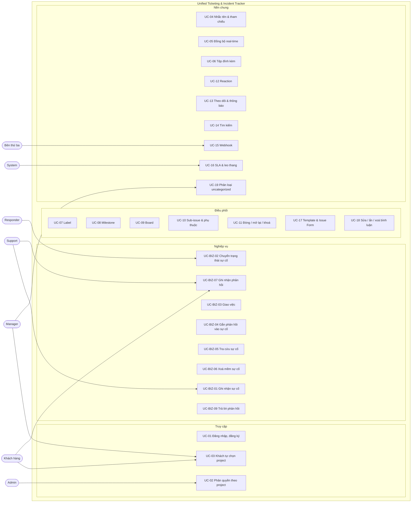
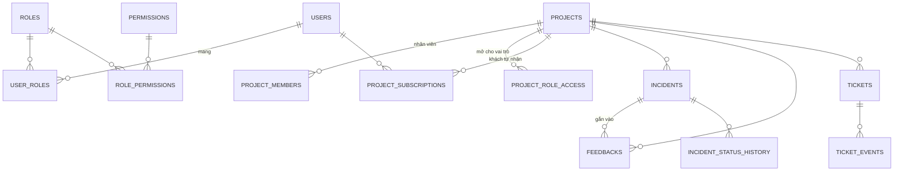
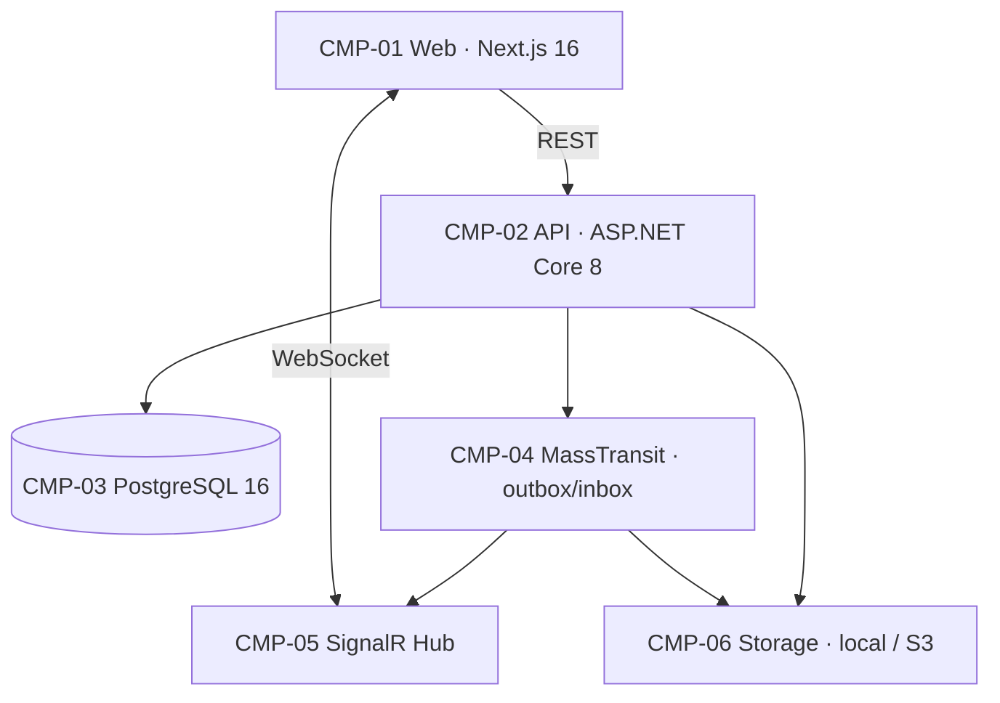
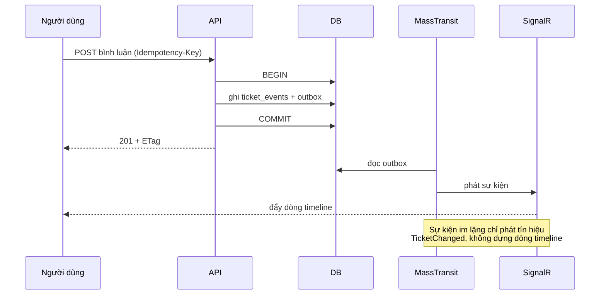

# PHÂN TÍCH & THIẾT KẾ HỆ THỐNG
# UNIFIED TICKETING & INCIDENT TRACKER

| Trường thông tin | Nội dung |
|---|---|
| Tên hệ thống | Unified Ticketing & Incident Tracker |
| Tài liệu | Bản đặc tả **duy nhất** của hệ thống. Mọi tài liệu khác tham chiếu về đây. |
| Nền tảng | ASP.NET Core 8 · EF Core 8 · PostgreSQL 16 · MassTransit · SignalR · Next.js 16 |
| Nhóm thực hiện | Nhóm 2 — Nguyễn Bảo Long, Nguyễn Huy Kiên, Lê Sơn Trường |

> Tài liệu này mô tả hệ thống **đang chạy**, không mô tả lịch sử thay đổi. Nó không so sánh
> tính năng với sản phẩm nào khác. Muốn đọc lịch sử thì xem `private/modify_*.md`.

---

## 1. Bối cảnh, mục tiêu và phạm vi

### 1.1 Vấn đề

Một tổ chức hỗ trợ khách hàng cần ba việc cùng lúc, và ba việc đó thường nằm ở ba hệ thống rời:

1. **Tiếp nhận** phản hồi khách hàng qua nhiều kênh (email, hotline, web).
2. **Xử lý** sự cố kỹ thuật với vòng đời trạng thái rõ ràng và cam kết thời gian.
3. **Điều phối** công việc nội bộ: giao việc, gắn nhãn, mốc phát hành, bảng công việc.

Tách rời ba việc này sinh ra ba hệ quả: dữ liệu trùng và lệch nhau, không ai nhìn được toàn cảnh
một sự việc, và không có một dòng thời gian chung để truy trách nhiệm.

### 1.2 Giải pháp ở mức khái niệm

Một hệ thống, ba module nghiệp vụ trên cùng một nền:

| Module | Đối tượng | Vòng đời |
|---|---|---|
| **Feedback** | Phản hồi khách hàng | Mới → Đã tiếp nhận → Đã trả lời |
| **Incident** | Sự cố kỹ thuật | Đang điều tra → Đang khắc phục → Đã giải quyết |
| **Ticket** | Công việc nội bộ | Mở → Đóng (kèm lý do) |

Ba module chia sẻ **một mô hình phân quyền theo project**, một sổ sự kiện, một hệ thống thông báo
và một hạ tầng real-time. Phản hồi gắn được vào sự cố; sự cố và phản hồi luôn nằm trong cùng một
project.

### 1.3 Mục tiêu và chỉ số

| ID | Mục tiêu | Chỉ số |
|---|---|---|
| GOAL-BIZ-01 | Trục thời gian hợp nhất | 100% sự kiện của một ticket nằm trên một luồng |
| GOAL-BIZ-02 | Phản hồi gắn được vào sự cố | Mọi phản hồi có thể trỏ tới đúng một sự cố cùng project |
| GOAL-RT-01 | Giao tiếp real-time | Độ trễ đẩy sự kiện < 300 ms |
| GOAL-SEC-01 | Cô lập ghi chú nội bộ | Không một byte nào của `INTERNAL_NOTE` tới socket khách hàng |
| GOAL-SEC-03 | Cách ly theo project | Không đọc/ghi được dữ liệu của project mình không có quyền |
| GOAL-PERF-01 | Tách tác vụ nặng | 100% việc gửi mail / webhook chạy nền |
| GOAL-PERF-02 | Không nhận stream upload | 100% tệp đi qua presigned URL |
| GOAL-ORG-01 | Tổ chức công việc | Ticket gắn được label, milestone, type, board |
| GOAL-LIFECYCLE-01 | Vòng đời chuẩn hoá | Đóng có lý do, mở lại, khoá, ghim đều có vết kiểm toán |
| GOAL-SEARCH-01 | Tìm kiếm | Query DSL `is:open label:bug assignee:@me` |
| GOAL-SLA-01 | Cam kết thời gian | Tự cảnh báo khi vượt ngưỡng, leo thang cho quản lý |
| GOAL-CONC-01 | Không mất cập nhật | `ETag`/`If-Match` + unique `(ticket_id, ticket_version)` |
| GOAL-REL-01 | Chống trùng khi retry | `Idempotency-Key` |
| GOAL-SEC-02 | Chống stored XSS | Markdown lưu thô, sanitize hai lớp khi render |

### 1.4 Ngoài phạm vi

Đăng nhập một lần (SSO), ứng dụng di động, đa ngôn ngữ ngoài Việt–Anh, và phân tích số liệu nâng
cao đều **không** thuộc phạm vi.

---

## 2. Vai trò và phân quyền

Đây là phần trung tâm của thiết kế: mọi module đều dựa vào nó.

### 2.1 Actor

| ID | Actor | Mô tả |
|---|---|---|
| ACT-01 | System | Giữ cấu hình nền toàn hệ thống |
| ACT-02 | Admin | Vận hành: tài khoản, RBAC, project |
| ACT-03 | Manager | Quản lý công việc và thành viên trong project mình phụ trách |
| ACT-BIZ-01 | Support | Tiếp nhận phản hồi, ghi nhận sự cố |
| ACT-BIZ-02 | Responder | Điều tra và khắc phục sự cố |
| ACT-BIZ-03 | Khách hàng | Gửi sự cố / phản hồi, theo dõi tiến độ |
| ACT-EXT-01 | Hệ thống bên thứ ba | Nhận webhook |

### 2.2 Vai trò dựng sẵn và thang cấp

| Vai trò | Cấp | Phạm vi | Trách nhiệm |
|---|---|---|---|
| `system` | 120 | Toàn cục | Cấu hình nền: chính sách SLA, bộ loại issue. Cộng mọi quyền của admin |
| `admin` | 100 | Toàn cục | Tài khoản, RBAC, tạo/xoá project |
| `manager` | 80 | Theo project | Điều phối công việc và thành viên trong project được cấp |
| `responder` | 60 | Theo project | Điều tra, khắc phục, đóng sự cố |
| `support` | 40 | Theo project | Ghi nhận sự cố, trả lời phản hồi |
| `customer` | 10 | Theo project | Gửi và theo dõi phần của mình |

**Vì sao tách `system` khỏi `admin`.** Đổi chính sách SLA là đổi cam kết dịch vụ của **mọi** project
cùng lúc; thêm một quản trị viên là việc vận hành thường ngày. Gộp hai thứ vào một vai trò thì mỗi
lần cần thêm người quản trị là trao luôn quyền đổi cam kết dịch vụ.

Tách vai trò thôi chưa đủ — phải tách cả **tài khoản**. `system` thuộc về một tài khoản riêng, khai
báo bằng `SEED__SYSTEMEMAIL` và `SEED__SYSTEMPASSWORD`; danh tính của nó **không có mặc định trong
mã nguồn**, vì đây là tài khoản duy nhất chạm được cấu hình nền. Bỏ trống cả hai thì tài khoản admin
bootstrap giữ tạm vai trò `system` — dự phòng để một bản cài mới không rơi vào ngõ cụt, không phải
thiết kế mong muốn.

Ranh giới có hiệu lực nhờ ràng buộc rank: `admin` ở cấp 100 không cấp nổi vai trò cấp 120 cho bất kỳ
ai, kể cả chính mình. Hệ quả kéo theo — **chỉ `system` mới tạo được admin mới**, vì cấp một vai trò
ngang cấp mình cũng bị chặn.

### 2.3 Phạm vi quyền

Chỉ `system` và `admin` có `Role.IsGlobal = true`. Mọi vai trò khác chỉ có quyền ở project được cấp.

Hai đường cấp quyền, trả lời hai câu hỏi khác nhau:

| Bảng | Câu hỏi | Dùng cho |
|---|---|---|
| `project_members` | Người **này** làm ở project nào, với vai trò gì | Nhân viên |
| `project_role_access` | Project này có **mở** cho vai trò nào | Khách hàng |

Cấp theo từng người cho hàng nghìn khách hàng là việc không ai làm nổi, nên khách hàng cấp theo
vai trò.

### 2.4 Vai trò tự phục vụ

Với vai trò trong `Permissions.SelfServiceRoles` (hiện chỉ có `customer`), quyền thật là **giao**
của hai vế:

```
quyền = (project mở cho vai trò)  ∧  (người dùng đã tự nhận project)
```

Vế thứ hai là `project_subscriptions`, do chính khách hàng bật ở tab **Projects**. Mô phỏng đúng
đời thật: chỉ nêu được sự cố của dịch vụ mình đang dùng. Vì là phép giao nên ô tick không phải một
đường tự cấp quyền — tự nhận một project chưa mở thì vẫn không vào được.

Luật này **không** áp cho vai trò nhân viên: cấp `role-access` cho `support` rồi cả nhóm vẫn đứng
ngoài cho tới khi từng người tự tick là hành vi không ai ngờ tới.

### 2.5 Cách phép kiểm quyền chạy

`PrincipalEnrichmentMiddleware` đọc vai trò và permission từ cơ sở dữ liệu ở **mỗi request**, rồi
phát thành claim. Thu hồi quyền có hiệu lực ngay, không chờ token hết hạn.

**Hình dạng đường dẫn quyết định phạm vi kiểm quyền:**

| Đường dẫn | Phạm vi |
|---|---|
| `api/projects/{project}/…` | Quyền **trong project đó** |
| Không có `{project}` | Quyền toàn cục ∪ hợp của mọi project |

Nhánh thứ hai là chỗ dễ leo thang: một manager có `user.read` ở một project sẽ đọc được toàn bộ
danh bạ nếu endpoint danh bạ không tự khai. Vì vậy nhóm endpoint quản trị toàn hệ thống dùng
`[RequireGlobalPermission]` — chỉ nhận quyền đến từ vai trò toàn cục.

Có **test canh gác** liệt kê mọi controller và bắt mỗi endpoint tự khai: nằm dưới
`api/projects/{project}`, hoặc nằm trong danh sách toàn cục **kèm lý do**.

### 2.6 Ba loại claim

| Claim | Ý nghĩa | Dùng để |
|---|---|---|
| `perm` | Quyền hiệu lực cho request này | Kiểm quyền |
| `gperm` | Chỉ quyền đến từ vai trò toàn cục | Endpoint quản trị hệ thống |
| `pperm` | Bản đồ `"{slug}:{code}"` | **Chỉ** để lọc dữ liệu trên màn hình xuyên project |

### 2.7 Ma trận quyền theo mức

| Mức | Permission tiêu biểu |
|---|---|
| Read | `ticket.read`, `incident.read`, `feedback.read` |
| Triage | `ticket.triage`, `ticket.internal_note`, `incident.assign` |
| Write | `ticket.write`, `label.write`, `milestone.write`, `board.write` |
| Project admin | `ticket.delete`, `project.manage`, `project.member.manage`, `webhook.manage` |
| System | `sla.manage`, `issue_type.manage` |

### 2.8 Project ảo `uncategorized`

Sự cố và phản hồi chưa gắn project nào (`ProjectId IS NULL`) nằm ở mục ảo `uncategorized`. Nó
**không có hàng** trong bảng `projects` — chỉ là một slug được nhận diện trong mã. Người có
`project.member.manage` thấy được mục này và chuyển dữ liệu ra project thật. Không ai tạo được
project trùng tên với nó.

---

## 3. Use Case

### 3.1 Ranh giới hệ thống



### 3.2 Đặc tả use case trọng yếu

| ID | Tên | Actor chính | Điều kiện trước | Kết quả |
|---|---|---|---|---|
| UC-BIZ-01 | Ghi nhận sự cố | Support, Khách hàng | Có `incident.create` trong project | Sự cố ở trạng thái *Đang điều tra*, người ghi nhận lấy từ tài khoản đăng nhập |
| UC-BIZ-02 | Chuyển trạng thái | Responder | Có `incident.update_status` | Trạng thái tiến đúng một bước; ghi lịch sử kèm ghi chú |
| UC-BIZ-04 | Gắn phản hồi vào sự cố | Support, Khách hàng | Phản hồi và sự cố **cùng project**; sự cố chưa đóng | Phản hồi chuyển *Đã tiếp nhận*; gắn lại được sang sự cố khác |
| UC-BIZ-09 | Trả lời phản hồi | Support | Có `feedback.respond` | Phản hồi chuyển *Đã trả lời*; khách nhận thông báo |
| UC-03 | Khách tự chọn project | Khách hàng | Project đã mở cho vai trò `customer` | Khách vào được project; bỏ chọn thì mất quyền xem, dữ liệu vẫn còn |
| UC-19 | Phân loại `uncategorized` | Manager, Admin | Có `project.member.manage` | Sự cố chuyển sang project thật, **kéo theo** phản hồi đã gắn |

---

## 4. Business Rules

### 4.1 Sự kiện

| ID | Quy tắc | Nơi chịu trách nhiệm |
|---|---|---|
| BR-EV-01 | **Bất biến**: không UPDATE/DELETE trên bảng sự kiện. Sửa/xoá phải thêm sự kiện bù trừ | DB / EF Core |
| BR-EV-02 | Nội dung sự kiện nằm trong cột `payload` (JSONB), schema do tầng ứng dụng quản lý | Application |
| BR-EV-03 | SignalR Hub lọc `INTERNAL_NOTE` theo claim trước khi gửi. Cấm gửi xuống socket khách hàng | Hub |
| BR-EV-04 | Bóc tách Markdown và gửi mail chạy trên MassTransit, có exponential backoff | Consumer |
| BR-EV-05 | API không nhận stream upload; bắt buộc presigned URL | Storage |
| BR-EV-06 | **Sự kiện im lặng** (`REACTED`, `SUBSCRIBED`, `COMMENT_EDITED`, `OPENED`…) không thành một dòng timeline. Truy vấn timeline và bộ phát real-time dùng **chung một danh sách** `TicketEventTypes.Silent` | Application + Broadcaster |

### 4.2 Sự cố và phản hồi

| ID | Quy tắc | Nơi chịu trách nhiệm |
|---|---|---|
| BR-BIZ-01 | Sự cố luôn tạo ở trạng thái *Đang điều tra*; không nhận trạng thái từ biểu mẫu | Application |
| BR-BIZ-02 | Trạng thái tiến đúng một bước: Investigating → Mitigating → Resolved. Nhảy cóc → `409` kèm bước hợp lệ | State machine |
| BR-BIZ-04 | Người ghi nhận lấy từ tài khoản đăng nhập, không nhận từ biểu mẫu | Application |
| BR-BIZ-05 | Bước sang *Resolved* đòi thêm `incident.resolve` | Authorization |
| BR-BIZ-06 | Chỉ người có `incident.update_status` mới nhận được việc; khách hàng không thể là người xử lý | Application |
| BR-BIZ-07 | Gắn phản hồi vào sự cố **đã đóng** → `409`, phản hồi giữ nguyên trạng thái | Application |
| BR-BIZ-08 | Xoá sự cố là **xoá mềm**; bản ghi biến khỏi mọi truy vấn nhờ global query filter | EF Core |
| BR-BIZ-09 | Bản ghi tồn tại nhưng ngoài phạm vi quyền → `404`, không phải `403`: `403` đã xác nhận nó có thật | Application |
| BR-BIZ-10 | Người không có `feedback.read.all` chỉ nhận về phản hồi do chính mình gửi | Application |
| BR-BIZ-11 | Gắn phản hồi đòi **cả hai vế**: phản hồi phải là của mình (trừ khi có `feedback.read.all`) và sự cố phải do mình báo hoặc được giao cho mình | Application |
| BR-BIZ-12 | Gắn vào sự cố là một hình thức tiếp nhận: phản hồi *Mới* chuyển *Đã tiếp nhận*; không hạ cấp *Đã trả lời* | Application |
| BR-BIZ-13 | **Phản hồi và sự cố nó gắn vào luôn cùng project.** Gắn xuyên project → `404`. Chuyển sự cố sang project khác thì phản hồi đã gắn đi theo; phản hồi đã gắn không chuyển riêng được (`409`) | Application |

### 4.3 Tổ chức, quan hệ, vòng đời

| ID | Quy tắc |
|---|---|
| BR-ORG-01 | Một ticket mang nhiều label nhưng chỉ thuộc **một** milestone tại một thời điểm |
| BR-ORG-02 | Xoá label: gỡ khỏi mọi ticket, đánh dấu `is_archived`; sự kiện `LABELED` cũ giữ nguyên nhờ snapshot tên/màu trong payload |
| BR-ORG-03 | Tối đa **10** người nhận việc / ticket; người nhận phải có quyền đọc project. Vượt → `422` |
| BR-ORG-04 | Tên label duy nhất trong project, không phân biệt hoa thường; màu 6 ký tự hex; project mới sinh 9 label mặc định |
| BR-ORG-05 | Milestone: tiêu đề duy nhất trong project; tiến độ = đóng / tổng; đóng milestone **không** đóng ticket bên trong |
| BR-ORG-06 | Issue type ở cấp toàn hệ thống; mỗi ticket 0..1 type; tắt một type thì ticket cũ giữ nguyên nhưng không chọn được nữa |
| BR-ORG-07 | Board độc lập với milestone; một ticket xuất hiện tối đa 1 lần / board; **xoá cột đòi cột trống**, còn thẻ → `409` kèm số thẻ |
| BR-REL-01 | Mọi request ghi chấp nhận `Idempotency-Key`; bắt buộc với `POST` tạo ticket/bình luận. Trùng key cùng nội dung → trả lại response gốc; trùng key khác nội dung → `422` |
| BR-REL-02 | Cấm tạo quan hệ sub-issue / phụ thuộc gây vòng lặp |
| BR-REL-03 | Ticket cha đóng được dù còn sub-issue mở; response kèm `warnings[]`. Bật `strict_close_policy` mới trả `409` |
| BR-REL-04 | Sub-issue có **đúng một** cha; tối đa 100 con trực tiếp; lồng tối đa 8 cấp |
| BR-REL-05 | Chuyển project: ticket nhận số mới; giữ label/milestone chỉ khi project đích có trùng tên; URL cũ redirect 301 |
| BR-REL-06 | Từ khoá đóng trong commit/PR (`fixes #N`) ghi `CONNECTED`, khi merge thì `CLOSED` với lý do `COMPLETED` |
| BR-LIFECYCLE-01 | Đóng kèm lý do ∈ {`COMPLETED`, `NOT_PLANNED`, `DUPLICATE`}; `DUPLICATE` bắt buộc kèm ticket gốc. Mở lại đặt lý do `REOPENED` |
| BR-LIFECYCLE-02 | Ticket bị khoá: chỉ Write+ được bình luận; **reaction tắt với mọi người**; sự kiện hệ thống vẫn ghi |
| BR-LIFECYCLE-03 | Bình luận vào ticket đã đóng **không** tự mở lại. Tuỳ chọn `auto_reopen_on_customer_comment` cho đội helpdesk |
| BR-LIFECYCLE-04 | Tối đa **3** ticket ghim mỗi project; ghim thứ 4 → `422` |
| BR-LIFECYCLE-05 | Xoá ticket chỉ Admin; ghi tombstone, ẩn khỏi mọi truy vấn, số không cấp lại |
| BR-EDIT-01 | Tác giả sửa/xoá bình luận của mình; Write+ sửa/xoá/ẩn của bất kỳ ai. Mỗi lần sửa lưu một bản, UI hiện "edited" và lịch sử |
| BR-TPL-01 | Ticket tạo từ Issue Form render thành Markdown theo thứ tự element; `required` chặn submit thiếu; `defaults` tự gắn label/assignee/type |

### 4.4 Tương tác và thông báo

| ID | Quy tắc |
|---|---|
| BR-SOCIAL-01 | 8 loại reaction; mỗi người **giữ được nhiều loại** trên cùng một đối tượng, nhưng mỗi loại tối đa một lần — unique `(ticket_id, event_id, user_id, reaction_type)`; gửi lại cùng loại = gỡ; bị chặn khi ticket khoá |
| BR-SOCIAL-02 | Theo dõi per-ticket: `SUBSCRIBED` / `UNSUBSCRIBED` / `IGNORED`. Theo dõi per-project: `ALL` / `PARTICIPATING` / `IGNORE` / `CUSTOM`. Thao tác thủ công luôn thắng auto-subscribe |
| BR-SOCIAL-03 | Đúng **một** dòng thông báo cho mỗi cặp (người dùng, ticket); sự kiện mới cập nhật dòng đó. Không thông báo cho chính người gây ra sự kiện |
| BR-SOCIAL-04 | `@login` chỉ tạo nhắc tên và auto-subscribe khi người được nhắc **có thật** và có quyền đọc; nhắc tên trong ghi chú nội bộ không bao giờ tới khách hàng |
| BR-SOCIAL-05 | Author association hiển thị cạnh tên: `OWNER` / `MEMBER` / `CONTRIBUTOR` / `FIRST_TIME_CONTRIBUTOR` / `NONE` |
| BR-SOCIAL-06 | **Tắt thông báo một project thì im thật**, kể cả trên ticket mình đang tự động theo dõi — trừ khi có người gọi thẳng tên mình. Nuốt luôn lời nhắc trực tiếp là cách chắc chắn để người ta bỏ lỡ thứ gửi đích danh cho họ |

### 4.5 Độ tin cậy và hiệu năng

| ID | Quy tắc |
|---|---|
| BR-CONC-01 | `GET` trả `ETag: "v{version}"`; `PATCH` kèm `If-Match` sai phiên bản → `412`. Chốt chặn cuối là unique `(ticket_id, ticket_version)` |
| BR-SCALE-01 | Timeline và mọi danh sách lớn dùng **keyset pagination**; cursor mã hoá base64; `per_page` ≤ 100; cấm `OFFSET` trên bảng lớn |
| BR-SCALE-02 | `ticket_events` **partition theo tháng**; mọi PK/unique trên bảng partition phải chứa `created_at` |
| BR-SCALE-03 | Danh sách ticket đọc từ read model chiếu sẵn, không replay sự kiện |

### 4.6 Bảo mật

| ID | Quy tắc |
|---|---|
| BR-SEC-01 | Ranh giới đọc soát ở **cả hai đầu** của mọi thao tác nối hai đối tượng |
| BR-SEC-02 | Lưu Markdown thô, sanitize khi render: server dựng HTML qua Markdig + `HtmlSanitizer`, client lọc lại bằng DOMPurify |
| BR-SEC-03 | Rate limit theo user/IP; trả `429` kèm `Retry-After` |
| BR-SEC-04 | Presigned URL giới hạn `Content-Type` và `Content-Length` ngay trong chữ ký; tệp chưa quét không phục vụ |
| BR-SEC-05 | Webhook ký `X-Hub-Signature-256`; chỉ `https`; chặn SSRF |
| BR-SEC-06 | Lọc visibility ở **mọi đầu ra**: timeline, comment, search, notification, webhook, socket |
| BR-SEC-07 | Kiểm quyền theo hành động ở tầng ứng dụng trước khi ghi sự kiện |
| BR-SEC-08 | **Thang cấp vai trò**: không ai tác động lên người ngang hoặc cao cấp hơn mình, và không tự gỡ vai trò của chính mình. Cấp của một người là cấp cao nhất trong các vai trò họ mang |
| BR-SEC-09 | Đổi mật khẩu **giết mọi phiên khác** của tài khoản đó: token cấp trước mốc đổi bị từ chối. Phiên đang thao tác được giữ lại |
| BR-SEC-10 | Ảnh và tệp phục vụ qua đường **ký HMAC theo khoá tệp** (`/api/storage/public/{key}?t=`). Thẻ `img` của trình duyệt không gửi được header `Authorization`, nên nếu chỉ có đường xác thực bằng token thì mọi ảnh đã tải lên đều hỏng. Chữ ký ràng theo khoá nên không sửa đường dẫn để với sang tệp khác |

---

## 5. User Story và Acceptance Criteria

### 5.1 Danh mục

| ID | Chủ đề | User story |
|---|---|---|
| US-EV-03 | Ghi chú nội bộ | Là Support, tôi muốn ghi chú nội bộ mà khách hàng không thấy |
| US-BIZ-03 | Giao việc | Là Support, tôi muốn giao sự cố cho kỹ thuật viên phù hợp |
| US-BIZ-04 | Gắn phản hồi | Là Support, tôi muốn gắn phản hồi vào sự cố để không xử lý trùng |
| US-ACCESS-01 | Tự chọn project | Là Khách hàng, tôi muốn tự chọn dự án mình đang dùng để gửi được sự cố |
| US-ORG-01 | Label | Là Support, tôi muốn gắn nhãn màu để lọc nhanh |
| US-LIFECYCLE-01 | Đóng / mở lại | Là Support, tôi muốn đóng ticket kèm lý do rõ ràng |
| US-SOCIAL-01 | Thông báo | Là Khách hàng, tôi muốn biết khi có người trả lời |
| US-SEARCH-01 | Tìm kiếm | Là Support, tôi muốn gõ `is:open assignee:@me` để lọc đúng việc của mình |
| US-SLA-01 | SLA | Là Manager, tôi muốn được cảnh báo khi ticket sắp vượt hạn |

### 5.2 US-EV-03 — Ghi chú nội bộ

| AC | Given | When | Then |
|---|---|---|---|
| AC01 | Support và Khách hàng cùng mở ticket | Support ghi chú nội bộ | Support thấy ngay qua WebSocket |
| AC02 | Khách hàng đang mở socket của ticket | Support ghi chú nội bộ | Không một byte nào tới socket khách |

### 5.3 US-BIZ-04 — Gắn phản hồi vào sự cố

| AC | Given | When | Then |
|---|---|---|---|
| AC01 | Phản hồi *Mới*, sự cố cùng project đang mở | Support gắn | Phản hồi chuyển *Đã tiếp nhận* |
| AC02 | Sự cố đã đóng | Support gắn | `409`; phản hồi giữ nguyên trạng thái |
| AC03 | Phản hồi đã gắn sự cố A | Support chọn sự cố B cùng project | Liên kết đổi sang B |
| AC04 | Sự cố ở project khác | Support gắn | `404` |

### 5.4 US-ACCESS-01 — Khách tự chọn project

| AC | Given | When | Then |
|---|---|---|---|
| AC01 | Project chưa mở cho `customer` | Khách mở danh mục | Project không xuất hiện; tự nhận → `404` |
| AC02 | Project đã mở, khách chưa tham gia | Khách mở project | `403`; danh mục hiện project với cờ chưa tham gia |
| AC03 | Khách bật công tắc tham gia | Gọi lại API | `200` ngay, **cùng token cũ** |
| AC04 | Khách rời project | Mở lại | `403`; dữ liệu đã gửi vẫn còn, tham gia lại là thấy lại |

### 5.5 US-LIFECYCLE-01 — Đóng và mở lại

| AC | Given | When | Then |
|---|---|---|---|
| AC01 | Ticket mở | Đóng "completed" | Ghi `CLOSED`; broadcast; webhook `issues.closed` |
| AC02 | Còn sub-issue mở, `strict_close_policy=false` | Đóng | `200` kèm `warnings: ["OPEN_SUB_ISSUES"]` |
| AC03 | Ticket đã đóng | Khách bình luận | Ticket **vẫn** đóng |
| AC04 | Ticket đã đóng | Mở lại tường minh | Lý do `REOPENED`, xoá `closed_at` |
| AC05 | Ticket bị khoá | Khách bình luận / reaction | `403` |

---

## 6. Mô hình dữ liệu

### 6.1 Nhóm bảng

| Nhóm | Bảng |
|---|---|
| Danh tính & quyền | `users`, `roles`, `permissions`, `user_roles`, `role_permissions` |
| Phân quyền project | `project_members`, `project_role_access`, `project_subscriptions` |
| Sự cố | `incidents`, `incident_status_history`, `incident_comments` |
| Phản hồi | `feedbacks`, `feedback_replies` |
| Ticket | `tickets`, `ticket_events`, `ticket_assignees`, `ticket_labels`, `ticket_references`, `ticket_redirects`, `ticket_reactions`, `ticket_subscriptions`, `ticket_templates` |
| Tổ chức | `projects`, `labels`, `milestones`, `issue_types`, `boards`, `board_columns`, `board_items` |
| Thông báo | `notification_threads`, `project_watches` |
| Tìm kiếm | `ticket_search_comments` |
| Tích hợp | `webhook_subscriptions`, `webhook_deliveries` |
| Hạ tầng | `idempotency_keys`, `sla_policies`, bảng outbox/inbox của MassTransit |

### 6.2 Quan hệ trọng yếu



`incidents.project_id` và `feedbacks.project_id` đều **cho phép null** — đó là mục `uncategorized`.

### 6.3 Ràng buộc ở tầng cơ sở dữ liệu

| Ràng buộc | Bảo vệ điều gì |
|---|---|
| `ux_roles_name` | Tên vai trò duy nhất |
| `ck_roles_rank_range` | Cấp vai trò trong 1..1000 |
| unique `(ticket_id, ticket_version)` | Hai request ghi song song không cùng thắng (BR-CONC-01) |
| unique `(user_id, ticket_id)` trên `notification_threads` | Đúng một luồng thông báo mỗi cặp (BR-SOCIAL-03) |
| unique `(ticket_id, event_id, user_id, reaction_type)` | Một loại reaction một lần (BR-SOCIAL-01) |
| khoá chính kép `(project_id, user_id)` trên `project_subscriptions` | Không tham gia trùng |
| partition theo tháng trên `ticket_events` | Bảng sự kiện không phình vô hạn (BR-SCALE-02) |

---

## 7. Thiết kế hệ thống

### 7.1 Thành phần



### 7.2 Nguyên tắc kiến trúc

| ID | Quyết định | Lý do |
|---|---|---|
| ADR-001 | Modular monolith, không microservice | Quy mô nhóm 3 người; ranh giới module đủ để tách sau |
| ADR-002 | Quy tắc vòng đời nằm trong state machine riêng, không rải trong controller | Controller chỉ điều phối; quy tắc kiểm được bằng unit test |
| ADR-003 | Xoá mềm bằng global query filter | Một chỗ lọc, không phụ thuộc lập trình viên nhớ thêm `WHERE` |
| ADR-004 | Nạp quyền theo từng request | Thu hồi quyền có hiệu lực ngay |
| ADR-005 | Outbox/inbox cho mọi việc chạy nền | Sự kiện không mất khi tiến trình chết giữa chừng |
| ADR-006 | Chỉ vai trò toàn cục mới có quyền toàn cục | Không có nhánh nào âm thầm nâng quyền project thành quyền hệ thống |

### 7.3 Sơ đồ tuần tự — ghi nhận và phát sự kiện



### 7.4 Hợp đồng API

| Nhóm | Đường dẫn |
|---|---|
| Danh tính | `api/auth`, `api/profiles`, `api/presence` |
| Quản trị | `api/users`, `api/roles`, `api/permissions` |
| Project | `api/projects`, `api/projects/{project}`, `api/project-catalog` |
| Sự cố | `api/projects/{project}/incidents` |
| Phản hồi | `api/projects/{project}/feedbacks` |
| Ticket | `api/projects/{project}/tickets`, `api/projects/{project}/milestones`, `api/projects/{project}/templates` |
| Xuyên project | `api/boards`, `api/notifications`, `api/search`, `api/tickets` |
| Hệ thống | `api/sla-policies`, `api/issue-types` |
| Hạ tầng | `api/storage`, `api/markdown`, `api/health`, `/metrics` |

Mã lỗi dùng chuẩn `application/problem+json`, luôn kèm `correlationId`.

### 7.5 Giao diện

Next.js App Router, không dùng framework UI. Ba nguyên tắc bắt buộc, đều có test canh gác:

1. **Mọi thao tác ghi có ba trạng thái** — đang xử lý, thành công, thất bại — đi qua `useAction`.
   Kết quả hiện dưới dạng **thẻ nổi**, không chèn vào luồng trang.
2. **Chuỗi hiển thị đi qua `tr()`**; `en.ts` không được thiếu hay thừa khoá.
3. **Điều khiển trên cùng một hàng cao bằng nhau** (`--control-h`); công tắc là ngoại lệ. Tiêu đề
   cột bảng không xuống dòng. Mỗi trang có một kicker trên tiêu đề, khoảng cách bằng nửa chiều cao
   tiêu đề.

---

## 8. Quan sát và vận hành

| Khía cạnh | Cách làm |
|---|---|
| Health | `/api/health` (liveness), `/api/health/system` (ba service) |
| Metrics | `/metrics` định dạng Prometheus |
| Trace | OpenTelemetry, tỷ lệ lấy mẫu cấu hình được |
| Log | Có cấu trúc, kèm `correlationId`. **Không** log câu lệnh SQL ở mặc định — bật bằng `SQL_LOG_LEVEL=Information` khi cần |
| Audit | Mọi thao tác đổi quyền / xoá / chuyển project ghi một dòng `Audit …` |
| Backup | Script trong `infra/scripts` |

**Vì sao log SQL mặc định tắt.** Bật ở mức `Information` thì một lần khởi động có dữ liệu demo in
ra hàng chục nghìn dòng và mất khoảng một phút mới lắng — đủ để chôn vùi mọi cảnh báo thật và làm
người xem tưởng hệ thống đang chạy vòng lặp.

---

## 9. Kiểm chứng

### 9.1 Nguyên tắc

| Nguyên tắc | Nghĩa là |
|---|---|
| Test chạy trên **PostgreSQL thật** | Không in-memory: ràng buộc, partition, `FOR UPDATE` chỉ đúng trên máy thật |
| **Kiểm chứng bằng cách hoàn tác** | Gỡ bản sửa ra, test phải đỏ; lắp lại, test phải xanh. Test xanh mà không biết vì sao là test vô nghĩa |
| Test canh gác | Có test tự quét mã nguồn và bắt mọi endpoint tự khai phạm vi, mọi thao tác ghi đủ ba trạng thái |
| Đo trên hệ thống đang chạy | Kết luận về hành vi phải có lệnh gọi thật kèm mã trạng thái, không chỉ dựa vào test |

### 9.2 Ma trận truy vết

| Yêu cầu | Hiện thực | Kiểm chứng |
|---|---|---|
| BR-BIZ-02 | `IncidentStateMachine` | `IncidentLifecycleTests` |
| BR-BIZ-13 | `EnsureLinkableAsync`, `TransferAsync` | `ClassificationTests` |
| BR-SEC-06 | `TimelineAccess`, `NotificationService` | `RealtimeTests`, `SocialTests` |
| BR-SEC-08 | `RbacService` | `RoleHierarchyTests` |
| BR-SEC-09 | `PrincipalEnrichmentMiddleware` | `ProfileAndPasswordTests` |
| BR-SEC-10 | `LocalStorageProvider.DownloadToken` | `IntegrationOpsTests` |
| BR-SOCIAL-01 | `ReactionService` | `SocialTests` |
| BR-SOCIAL-06 | `NotificationService` | `SocialTests` |
| BR-EV-06 | `TicketEventTypes.Silent` | `RealtimeTests` |
| GOAL-SEC-03 | `PrincipalEnrichmentMiddleware` | `ProjectIsolationTests` |
| Vai trò tự phục vụ | `ProjectCatalogService` | `ProjectCatalogTests` |
| Tìm kiếm trong danh sách | `q` của incident / feedback / inbox | `ListSearchTests` |

### 9.3 Lớp kiểm thử

| Lớp | Phạm vi |
|---|---|
| Unit | State machine, renderer Markdown, DSL tìm kiếm |
| Integration | Toàn bộ API trên Postgres thật, gồm SignalR và outbox |
| Frontend | Hợp đồng ba trạng thái, i18n, component |
| Vận hành | Health, metrics, backup/restore |

---

## 10. Nhóm thực hiện và quy trình

### 10.1 Vai trò

| Thành viên | Vai trò | Chịu trách nhiệm |
|---|---|---|
| Nguyễn Bảo Long | **Owner · Tech Lead · BA · QA** | Chốt phạm vi và yêu cầu, quyết định kiến trúc, duyệt thiết kế, định nghĩa tiêu chí chấp nhận, chủ trì kiểm thử và UAT |
| Nguyễn Huy Kiên | **Developer · Tester** | Hiện thực tính năng, viết test cho phần mình làm, kiểm chéo phần của Trường |
| Lê Sơn Trường | **Developer · Tester** | Hiện thực tính năng, viết test cho phần mình làm, kiểm chéo phần của Kiên |

Owner kiêm QA nên **mọi thay đổi phải có test đi kèm trước khi xin duyệt** — người duyệt không
phải là người vừa viết mã đó.

### 10.2 Cổng duyệt

| Cổng | Điều kiện |
|---|---|
| G1 — Yêu cầu | Use case, business rule, tiêu chí chấp nhận đã chốt |
| G2 — Thiết kế | Mô hình dữ liệu và hợp đồng API đã duyệt |
| G3 — Hiện thực | Test xanh, không lệch khỏi thiết kế mà chưa ghi lý do |
| G4 — Vận hành | Health, metrics, backup đã diễn tập |
| G5 — Nghiệm thu | UAT theo vai trò đạt, demo chạy được từ máy sạch |

### 10.3 Quy ước làm việc

- Mỗi thay đổi đi kèm test; test phải **đỏ trước khi có bản sửa**.
- Lệch khỏi thiết kế phải ghi lý do vào `public/docs/decisions.md`.
- Không commit bí mật; `.env` nằm ngoài quản lý mã nguồn.

---

## 11. Phụ lục

### 11.1 Vai trò và quyền dựng sẵn

| Vai trò | Quyền |
|---|---|
| `system` | Toàn bộ quyền của `admin`, cộng `sla.manage`, `issue_type.manage` |
| `admin` | Quản trị tài khoản và RBAC, toàn quyền nghiệp vụ, `project.manage`, `project.member.manage`, `webhook.manage` |
| `manager` | Toàn quyền nghiệp vụ trong project, `project.manage`, `project.member.manage`, `ticket.delete` |
| `responder` | Đọc/xử lý/đóng sự cố, ghi chú nội bộ, ticket write |
| `support` | Ghi nhận sự cố và phản hồi, trả lời khách, ticket triage |
| `customer` | Gửi và theo dõi sự cố / phản hồi trong project mình tham gia, ticket read |

### 11.2 Trạng thái

| Đối tượng | Trạng thái |
|---|---|
| Sự cố | `Investigating` → `Mitigating` → `Resolved` |
| Phản hồi | `New` → `Acknowledged` → `Responded` |
| Ticket | `open` ↔ `closed` (kèm lý do) |
| Milestone | `open` / `closed` |
| Hiện diện | `online` / `snooze` / `offline` / `invisible` |

### 11.3 Từ điển thuật ngữ

| Thuật ngữ | Nghĩa trong hệ thống này |
|---|---|
| Project | Đơn vị cách ly quyền. Mọi dữ liệu nghiệp vụ thuộc về đúng một project, hoặc chưa phân loại |
| Sự kiện im lặng | Sự kiện được ghi vào sổ nhưng không thành một dòng trên timeline |
| Project ảo | `uncategorized` — không có hàng trong bảng `projects`, chỉ là một slug trong mã |
| Vai trò tự phục vụ | Vai trò mà người dùng tự chọn project để tham gia |
| Kicker | Dòng chữ nhỏ màu accent nằm trên tiêu đề trang |
